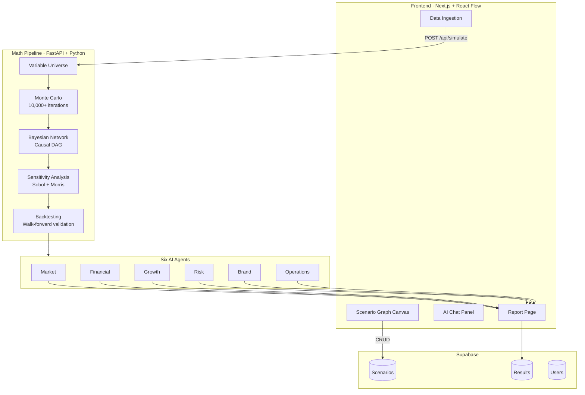

# optX

**High-grade strategy, without the consulting bill.**

optX is an AI-powered business simulator that turns raw company data into structured, auditable scenario intelligence. Ingest your financials, build scenarios on a node-graph canvas, and watch six specialized AI agents debate, simulate, and converge on ranked recommendations — all without a six-figure consulting engagement.

---

## Demo Flow

1. **Ingest** — Upload financials (balance sheet, income statement, cash flow) and layer in contextual signals: interest rates, market sentiment, workforce data, supply chain, and more
2. **Simulate** — The math pipeline constructs a unified variable universe, runs 10,000+ Monte Carlo iterations with copula-preserved correlations, and builds a Bayesian causal DAG
3. **Explore** — Drop into the n8n-style node graph to wire up custom scenario logic, connect nodes, and watch the canvas update live
4. **Debate** — Six AI agents (Market, Financial, Growth, Risk, Brand, Operations) analyze the simulation output, challenge each other, and converge on a ranked set of strategic recommendations
5. **Report** — Fan charts, tornado charts, waterfall P&L breakdowns, and a calibrated Accuracy Report you can actually trust

---

## Architecture

| Layer | Stack | Role |
| --- | --- | --- |
| **Frontend** | Next.js · React · React Flow · Recharts · Tailwind | Dark-mode node canvas, data ingestion UI, real-time charts |
| **State** | Zustand | Graph state, simulation runs, agent outputs |
| **AI** | OpenAI (gpt-4o / gpt-4o-mini) | Agents, scenario generation, AI chat, custom data extraction |
| **Backend** | FastAPI · Python | Math pipeline — Monte Carlo, Bayesian networks, sensitivity, backtesting |
| **Database** | Supabase (Postgres) | User auth, persisted scenarios, simulation results |



---

## Math Pipeline

The intellectual core of optX. Five stages run in sequence on every simulation:

| Stage | Method | Output |
| --- | --- | --- |
| **Variable Universe** | Empirical distributions, copulas | Joint probability model of all inputs |
| **Monte Carlo** | 10,000+ iterations, correlated sampling | P5–P95 outcome distributions for every metric |
| **Bayesian Network** | Directed acyclic graph, posterior updates | Causal map: which variables drive which outcomes |
| **Sensitivity Analysis** | Sobol indices, Morris method, SHAP attribution | "Your net income is 40% driven by raw material costs" |
| **Backtesting** | Walk-forward validation, Brier scores, calibration | Accuracy Report — model predicted within ±X% for Y% of test periods |

---

## Quickstart

```bash
# Frontend
npm install
npm run dev

# Backend (separate terminal)
cd python
pip install -r requirements.txt
python -m uvicorn main:app --reload --port 8000
```

**Required env vars** (`.env.local`):

- `NEXT_PUBLIC_SUPABASE_URL`
- `NEXT_PUBLIC_SUPABASE_ANON_KEY`
- `SUPABASE_SERVICE_ROLE_KEY`
- `PYTHON_API_URL=http://localhost:8000`
- `OPENAI_API_KEY` (also add to `python/.env`)

Open [http://localhost:3000](http://localhost:3000). Both services must be running.

---

## Key API Endpoints

```
GET  /health                → service status
POST /api/simulate          → run full math pipeline on ingested data
POST /api/scenario          → create / update scenario graph
POST /api/chat              → AI chat with scenario context
GET  /api/results/{id}      → fetch simulation results + accuracy report
```

---

## Tech Stack

| Layer | Technology |
| --- | --- |
| Framework | Next.js 16 (App Router, TypeScript) |
| Graph Editor | React Flow (`@xyflow/react`) |
| Charts | Recharts |
| State | Zustand |
| Styling | Tailwind 4 + ShadCN |
| AI | OpenAI API (gpt-4o / gpt-4o-mini) |
| Backend | Python · FastAPI |
| Math | Monte Carlo · Bayesian Networks · Sobol · Walk-forward validation |
| Database | Supabase (Postgres) |

---

## Team

Built by **Krish** (backend + math pipeline + AI agents) and team (frontend + UX).

---

*optX — scenario intelligence for strategic decisions.*
