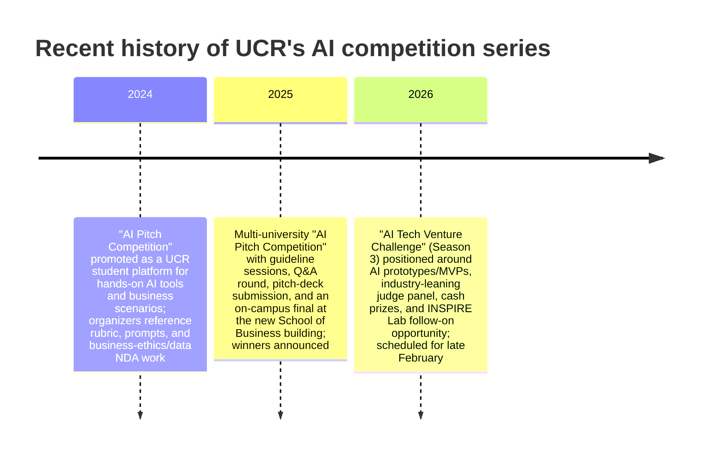

# UCR AI Tech Venture Challenge: Deep Research Report

## Executive summary

The “AI Tech Venture Challenge” at entity["organization","University of California, Riverside","public university in california"] appears to be the latest branding of a student-run, late-winter AI pitch competition series organized by entity["organization","The Product Club at UCR","student org at ucr"] (often described as the “AGSM Product Club”). In the most recent public materials (for the upcoming edition scheduled for late February), the event is framed as an inter‑university showcase of AI prototypes/MVPs with cash prizes, industry feedback, and a pathway to further development through the UCR entity["organization","INSPIRE Lab","innovation lab, ucr"]. citeturn18search11turn12search3turn34search29

Over the last three editions, the series shows a clear trajectory:
- It began as an “AI Pitch Competition” focused on hands‑on use of AI tools applied to real-time business scenarios—expressly including marketing strategy deliverables and organizer-created prompt questions, grading rubrics, and even a data non‑disclosure agreement. citeturn33view0turn40view0  
- It expanded in the following year into a multi‑university competition culminating in an on-campus final event in the new entity["organization","UCR School of Business","business school at ucr"] building, with a multi-stage process (team formation, guideline sessions, Q&A round, pitch-deck submission, and final live judging). citeturn11search10turn11search12  
- It now emphasizes venture-style prototypes/MVPs, broader eligibility (undergraduate, graduate, and PhD teams across universities), and a judging panel dominated by senior product/tech and security leaders, complemented by UCR faculty. citeturn18search11turn12search3

Transparency varies by year. The strongest “primary” documentation is for the second year (a published School of Business write-up plus an official UCR Events Calendar listing). For the current year, essential operational details (date, time, venue, team size, and judges) are available primarily through LinkedIn and Instagram posts; deadlines appear inconsistent across posts (examples include Feb. 2, Feb. 12, and Feb. 17), and a public scoring rubric specific to this challenge was not found in accessible sources. citeturn18search11turn20search14turn25search1turn12search3

Independent/third-party signals (e.g., another university’s innovation hub listing the event as an external opportunity, participant posts describing deliverables, and cross-campus product clubs promoting it) indicate that the competition is taken seriously as an experiential learning and networking forum, though public evidence of post-competition startup formation/funding outcomes is limited. citeturn12search2turn26view0turn19search2

## What it is and official descriptions

### Current framing

In sponsor and organizer posts for the current edition, the event is described as a platform for inter‑university student teams (undergraduate, graduate, PhD) to pitch “bold AI ideas” and showcase “AI prototypes and MVPs,” with “cash prizes,” networking with industry leaders, real-world feedback, and an “opportunity to further develop” the MVP with UCR’s INSPIRE Lab. citeturn18search11

A separate judge announcement post (shared by a participating judge and quoting the organizer) describes the event as hosted by the UCR School of Business and open to “all universities,” with teams of “2–5,” and hosted at the UCR School of Business (Auditorium 165). citeturn12search3

image_group{"layout":"carousel","aspect_ratio":"16:9","query":["UC Riverside School of Business building exterior","UC Riverside School of Business auditorium","UC Riverside pitch competition students presenting","UCR INSPIRE Lab University of California Riverside"] ,"num_per_query":1}

### Prior-year published characterization

For the immediately preceding year, the School of Business published a competition overview stating that the “AI Pitch Competition” was organized and hosted by the student Product Club; it brought together “forty graduate students from 11 California universities” to develop AI-driven solutions to “real-world business questions,” culminating in a final live event at the new School of Business building. citeturn11search10

This write-up emphasizes the competition’s career-preparation function (AI, product management, tech-driven industries) and interdisciplinarity (teams spanning multiple majors). citeturn11search10

## History and timeline

### Founding and frequency

Public evidence supports a three-season arc (at least) culminating in the current “Season 3” messaging and a late-February schedule. citeturn25search4turn18search11

The earliest edition within the requested window is the “AI Pitch Competition 2024,” promoted as an “upcoming” event by the Product Club with a named organizing board team. citeturn33view0 That edition’s organizer reflections confirm substantial operational scaffolding (rubric creation, prompt questions, data NDA, code of ethics). citeturn40view0

The second edition (late February of the next year) is documented as a month-long process culminating in a Feb. 28 final event. citeturn11search10turn11search12

The current edition is scheduled for Feb. 27 (morning through mid-afternoon) in the School of Business auditorium, and is framed as the venture- and MVP-oriented “AI Tech Venture Challenge.” citeturn18search11turn12search3turn12search2

### Notable editions and evolution

The series evolved in at least three ways:

First, scope: from a UCR-student “platform” emphasizing AI tools and marketing strategy outputs (including STP strategy) to a multi-university competition with large cross-campus participation. citeturn33view0turn11search10turn40view0

Second, format maturity: from an organizer-defined business scenario/prompt style (with explicit mention of prompts and real-time business data) to a structured multi-stage pitch pipeline (guidelines sessions, Q&A round, pitch-deck submission, and final live judging). citeturn40view0turn11search10

Third, market orientation: from “AI Pitch Competition” to “AI Tech Venture Challenge,” with explicit emphasis on “prototype or MVP” showcasing and post-competition MVP development through INSPIRE Lab. citeturn18search11



## Organizers, sponsors, and ecosystem support

### Organizers

Across the period reviewed, the consistent organizer is the student entity["organization","A. Gary Anderson Graduate School of Management","grad business school at ucr"] Product Club/“Product Club at UCR,” which publicly named a dedicated board team for the first-year edition and described its goal as giving students hands-on AI-tool experience and exposure to real business scenarios. citeturn33view0

For the second year, the School of Business write-up again attributes organization and hosting to the student Product Club. citeturn11search10

### Sponsors and partners

The current edition includes an “exclusive sponsorship” by entity["company","Enkrypt AI","ai security company"] in one organizer-sponsor post, and Enkrypt AI separately publicized that its CPO would participate as a judge/panelist. citeturn18search11turn18search5

Follow-on support is explicitly linked to INSPIRE Lab: the sponsor-organizer post advertises an “opportunity to further develop your MVP with the UCR Inspire Lab,” and a judge spotlight post frames INSPIRE Lab leadership as part of the judging talent base. citeturn18search11turn34search29

Independent context on INSPIRE Lab (as an innovation environment) is provided by an official UCR Business news item announcing the lab’s opening and describing it as a collaborative “playground” for students, directed by Sanjoy Moulik and Rich Yueh. citeturn34search5

### Mentor/incubator involvement

For the second-year “AI Pitch Competition,” the published School of Business overview states that participants connected with “industry leaders and mentors” during the preparation process and that these interactions guided teams on impact, responsible scaling, and ethical considerations. citeturn11search10

For the current “AI Tech Venture Challenge,” the only explicit follow-on structure found in accessible sources is the INSPIRE Lab development opportunity; specific mentor rosters, incubator cohorts, or formal accelerator commitments tied to this challenge were not publicly specified. citeturn18search11turn34search5

## Eligibility, applications, submissions, and deadlines

### Eligibility

For the current edition, eligibility is characterized in multiple posts as inter‑university and student-focused, with teams consisting of “2–5” participants and an “open to all universities” invitation; one sponsor post also explicitly includes undergraduate, graduate, and PhD students. citeturn12search3turn18search11

For the second-year edition, the School of Business write-up describes participants as graduate students (40 total) from 11 California universities, while also stating that teams could be in “any major” and emphasizes interdisciplinarity across majors. citeturn11search10

### Application mechanics

For the current edition, team and audience registration links circulated via LinkedIn redirect to external form tools (Smartsheet links were visible through LinkedIn’s external link warning pages), but the forms themselves were not readable via accessible sources in this research (likely due to dynamic rendering). As a result, required application fields and compliance checkboxes are unspecified from public sources. citeturn13view0turn13view1turn14view0turn14view1

For the second-year edition, the official UCR Events Calendar listing is an “AI Pitch Competition Final Event” RSVP for attendees (rather than a team application portal), positioning it as a conference-style day with lunch and networking. citeturn11search12

### Submission requirements

For the current edition, submissions are described at a high level as presenting/pitching an “AI prototype or MVP,” and “ideas or MVP,” with a live pitch in front of judges. A detailed pitch deck template, demo checklist, or technical requirements document was not found in accessible primary sources. citeturn18search11turn12search3

For the second-year edition, the School of Business overview explicitly states teams “submitted their pitch decks” and then “presented their ideas to a panel of judges” at the final event. citeturn11search10

For the first-year edition, an organizer’s retrospective provides unusually concrete operational detail: organizers “created the grading rubric,” drafted a “data non‑disclosure agreement,” set a “code of business ethics,” and formulated “prompt questions,” while also balancing “technology and business” to elicit “AI-driven business solutions” and using “real-time business data for the STP strategy.” citeturn40view0turn33view0

### Deadlines and scheduling

Current-year deadlines are inconsistent across public posts:
- A sponsor/organizer post lists a “Registration deadline: 2 February” for the Feb. 27 event. citeturn18search11  
- An Instagram post snippet lists “Registration Deadline: Feb 12, 2026.” citeturn20search14  
- Another Instagram reel snippet lists “REGISTERATION DEADLINE 17 FEBRUARY.” citeturn25search1  

In absence of an accessible official landing page with a change-log, the most rigorous conclusion is that (a) deadlines may have been extended, and (b) the operative deadline was not uniquely verifiable from available primary sources.

For the second-year edition, the timeline is clearer: teams formed in early February, worked through the month, and presented at the Feb. 28 final event (10:00 AM–3:00 PM). citeturn11search10turn11search12

Independent scheduling corroboration: an external university innovation hub listed the current-year event as an external opportunity and included the Feb. 27 date/time window and venue details, and noted “$25 per team” with audiences free. citeturn12search2

## Judging process, criteria, and rubrics

### Process and rounds

Second-year process (best documented) includes:
- Team formation early in February  
- “Virtual guideline sessions” and a “Q&A round” during the month  
- Submission of pitch decks  
- Final live event with presentation to a panel of judges citeturn11search10  

The official UCR Events Calendar listing for the final event frames it as a showcase day with networking and “industry experts” as judges, running 10:00 AM–3:00 PM with lunch. citeturn11search12

First-year process (organizer perspective) confirms behind-the-scenes judging infrastructure (rubric development) and governance (business ethics code, data NDA), implying a structured evaluation rather than an ad-hoc pitch day. citeturn40view0

Current-year process: posts confirm a live pitch (and the requirement to have an AI idea/MVP), but do not provide a publicly accessible breakdown of rounds (e.g., prelims/semis/finals), demo requirements, or time-per-pitch/Q&A rules. citeturn12search3turn18search11

### Explicit judging criteria and scoring rubrics

Second-year judging criteria are explicitly stated at the category level: entries were “judged on innovation, feasibility, and impact.” citeturn11search10

A numeric scoring rubric (e.g., weights, point ranges, criteria definitions) is not published in the School of Business article, nor found elsewhere in accessible, attributable sources for this competition series. citeturn11search10

First-year organizers explicitly report that they created a “grading rubric,” but the rubric itself (criteria, weights, scoring anchors) is not publicly shared in accessible sources. citeturn40view0

Current-year rubric and criteria: posts emphasize AI prototypes/MVPs and “real-world impact,” and the judge roster implies focus areas such as AI security, product leadership, and commercialization; however, an explicit scoring system specific to this challenge is unspecified from accessible primary documents. citeturn18search11turn12search3turn18search5

## Judges and panel analysis

### Current and recent judging panels

Across the three most recent seasons, the judging roster shifted from primarily UCR-affiliated faculty and one external judge set, to a current panel that is more heavily industry-facing (CPO/SVP/product founders/marketing execs) plus UCR faculty leadership. citeturn9view0turn11search10turn12search3

The current-year posts list judges drawn from: entity["company","Ocient","hyperscale data analytics firm"], entity["company","CenTrak","healthcare rfid and rtls company"], entity["company","AuraPath AI","ai product studio"], entity["company","TCWGlobal","hr and staffing services firm"], and entity["company","DK Global, Inc.","trial graphics and animation"], as well as the INSPIRE Lab/UCR faculty. citeturn12search3turn34search29turn37search22

### Judge comparison table

The table below consolidates unique judges documented across the last three seasons (current year plus the two prior editions), with role noted by season where available.

| Judge | Affiliation at time of judging (publicly stated) | Specialty/expertise (from bios and/or role) | Role in challenge | Public bio / profile |
|---|---|---|---|---|
| entity["people","Nathan Trueblood","cpo at enkrypt ai"] | Chief Product Officer, Enkrypt AI | Enterprise SaaS/cloud product leadership; AI security & “trusted AI systems” | Judge & panelist (current year) | citeturn38search1turn38search8turn38search14 |
| entity["people","Andrew Borene","exec director, ocient onss"] | Executive Director, Ocient National Security Solutions (as listed by organizers) | National security / threat intelligence / cybersecurity leadership (public bios also describe senior roles in security analysis and intelligence) | Judge (current year) | citeturn12search3turn38search0turn38search24turn38search4 |
| entity["people","Sid Nair","svp product at centrak"] | Senior VP/SVP, Product, CenTrak (as listed/announced) | Product leadership across SaaS and enterprise environments (per profile) | Judge (current year) | citeturn12search3turn37search0turn37search4 |
| entity["people","Travis Johnson","cofounder aurapath ai"] | Co‑Founder, AuraPath AI; Senior Product Manager, TCWGlobal (as listed) | AI-native product building; AI strategy & implementation; health/human performance intersection (self-description) | Judge (current year) | citeturn12search3turn37search1turn37search5turn37search28 |
| entity["people","Aaron Saltzman","cmo at dk global"] | Chief Marketing Officer, DK Global, Inc. | Marketing strategy, analytics, leadership; UCR alumni context in School of Business feature | Judge (current year) | citeturn12search3turn37search2turn37search22 |
| entity["people","Sanjoy Moulik","ucla visiting? no, ucr faculty"] | Assistant Professor (Information Systems) & Director, INSPIRE Lab, UCR | Information systems; applied AI/data analytics; advisory work (as described in judge spotlight) | Judge (second-year; current-year) | citeturn34search1turn34search29turn11search10 |
| entity["people","Rich Yueh","assistant professor ucr"] | Assistant Professor of Teaching, Information Systems, UCR | AI in education and applied technology; co-directs INSPIRE Lab (per UCR sources) | Judge (first-year; second-year) | citeturn34search0turn34search5turn9view0 |
| entity["people","Paea LePendu","assoc teaching professor ucr cse"] | Associate Professor of Teaching, Computer Science & Engineering, UCR | Biomedical informatics, data mining/NLP applications (per UCR profile/site) | Judge (second-year) | citeturn34search7turn34search3turn11search10 |
| entity["people","Stephen James","anthropology lecturer ucr"] | Lecturer, Anthropology (and related programs), UCR | Social science lens; cultural/anthropological expertise supporting “impact” assessment | Judge (second-year) | citeturn35search2turn11search10 |
| entity["people","Ashish Sood","associate professor marketing ucr"] | Associate Professor of Marketing, UCR | Innovation, technology strategy, marketing analytics (per UCR profile) | Judge (second-year) | citeturn34search2turn11search10 |
| entity["people","Marlo Raveendran","associate professor management ucr"] | Associate Professor of Management, UCR | Organization design and strategy (relevant to scaling ventures and execution) | Judge (first-year) | citeturn36search4turn9view0turn40view0 |
| entity["people","Sourav Roy","business leader at speridian"] | Business/technology consulting leader (profile indicates Speridian Technologies) | Business & technology consulting; external industry judge signal | Judge (first-year) | citeturn37search7turn9view0turn40view0 |

### One-paragraph judge bios emphasizing relevance

Nathan Trueblood is a senior product executive who serves as Chief Product Officer at Enkrypt AI and is publicly positioned as a leader focused on building secure, scalable, and responsible AI systems for enterprises; both sponsor communications and company materials emphasize decades of experience spanning enterprise software, SaaS, and cloud-era product building, alongside leadership roles at major tech firms and startup co-founding experience, making him particularly relevant to evaluating MVP feasibility, product strategy, and responsible AI commercialization. citeturn38search8turn38search1turn38search14turn18search5

Andrew Borene is listed by the event organizers as a judge representing Ocient’s national security solutions unit; multiple public bios (not all updated to the same employer) characterize him as a senior security and intelligence professional spanning threat intelligence, cybersecurity, and national-security policy roles, including experience providing security analysis and holding senior positions in U.S. national-security institutions—an orientation that matches the challenge’s current emphasis on real-world deployment constraints, security posture, and high-stakes data systems. citeturn12search3turn38search0turn38search24turn38search4

Sid Nair is a product executive who publicly announced joining CenTrak as SVP of Product; his profile positioning as a cross-functional SaaS and product/business leader suggests relevance to evaluating product-market fit logic, deployment feasibility, and operationalization of AI solutions in regulated or enterprise-like settings (often a key weakness in student pitch competitions). citeturn37search4turn37search0turn12search3

Travis Johnson is a product builder and founder (AuraPath AI) who also publicly states he helps businesses achieve ROI through AI strategy and implementation; he explicitly posted about being honored to judge the current challenge, and his personal site frames his work at the intersection of AI, health, and human performance—experience that maps well to assessing whether prototypes demonstrate real user value, implementable paths to adoption, and coherent product narratives beyond raw model demos. citeturn37search28turn37search5turn12search3

Aaron Saltzman, currently Chief Marketing Officer at DK Global, is also highlighted in an official UCR School of Business feature that contextualizes his career path and leadership approach; his relevance to the challenge is strongest in market-facing evaluation—positioning, storytelling, go-to-market clarity, and whether a technical prototype is framed as an investable product with clear customer and value proposition. citeturn37search22turn12search3turn37search2

Sanjoy Moulik is a UCR information systems faculty member and Director of INSPIRE Lab; in organizer judge-spotlights, he is also described as an advisor to organizations on policy, health informatics, and strategic transformation, indicating applied, cross-domain expertise. Across years he appears both as a judge and as a supporter supplying “real-time business data” for marketing strategy work, making him central to the competition’s intended bridge between AI tooling and business execution. citeturn34search1turn34search29turn40view0turn11search10

Rich Yueh is an award-recognized UCR teaching faculty member in information systems and—per UCR Business news—co-directs INSPIRE Lab with Sanjoy Moulik; he is repeatedly tied to AI-in-practice education and applied technology learning. Participant commentary in a winner post suggests he valued concrete demo/“walkthrough video” work, aligning his judging relevance with execution quality, clarity of solution communication, and the credibility of technical feasibility claims. citeturn34search5turn34search0turn26view0

Paea LePendu is an associate teaching professor in computer science and engineering with public descriptions emphasizing biomedical informatics and data-driven/NLP-adjacent work; as a judge in the second-year edition, his expertise adds technical evaluation power—especially around data integrity, modeling choices, and whether solutions are plausible beyond pitch narratives. citeturn34search3turn34search7turn11search10

Stephen James is a lecturer in anthropology (and related UCR programs) who served as a judge in the second-year edition; while not marketed as an AI technologist, his disciplinary lens is directly relevant to “impact” evaluation, societal considerations, and whether proposed AI applications are grounded in human context, ethics, and real stakeholder needs—explicit themes the competition highlights as part of mentoring and feedback. citeturn35search2turn11search10

Ashish Sood is a UCR marketing professor whose UCR profile emphasizes research on innovation and technology-related marketing strategy; in the second-year judging panel, this background aligns well with assessing differentiation and innovation claims, and whether a proposed AI solution has defensible value in competitive markets beyond the novelty of using AI. citeturn34search2turn11search10

Marlo Raveendran is a UCR business faculty member whose publicly stated research focus centers on organization design and strategic/structural questions; as a first-year judge, that perspective is particularly relevant to venture viability and execution—how teams organize work, how scaling might occur, and whether the story coheres into an executable operating model rather than a one-off concept. citeturn36search4turn9view0turn40view0

Sourav Roy served as a first-year judge and is linked by organizer posts to an industry/consulting background (as indicated by his public profile); this kind of external judge role is often designed to pressure-test commercialization logic, customer realism, and business framing—especially important in early editions where student teams may over-index on tool novelty rather than stakeholder clarity. citeturn9view0turn37search7turn40view0

### Public judge videos or recorded panels

Publicly accessible recordings specifically labeled as “judge panels” for this challenge were not found in the available primary sources. However, at least one judge-linked video exists in a sponsor post, and UCR-produced videos exist for some faculty judges.

```text
Judge-linked video tied to the current edition (timestamp: 0:00 start)
- Enkrypt AI post featuring Nathan Trueblood speaking about joining the event as judge/panelist:
  https://www.linkedin.com/posts/enkryptai_enkryptai-ucr-agsm-activity-7426718563853336576-Oo7k

Faculty judge videos (timestamp: 0:00 start)
- “Innovative Teaching Award: Rich Yueh, Business” (UCR studio YouTube):
  https://www.youtube.com/watch?v=Ym30UrO0mgQ
- “Prof. Ashish Sood receives UC Riverside Innovative Teaching ...” (YouTube):
  https://www.youtube.com/watch?v=8sQwVioyrTg
```

The Enkrypt AI post includes an auto-generated transcript in the page rendering, but does not provide segment timestamps in accessible text. citeturn25search11turn34search20turn34search6

### Independent coverage, testimonials, critiques, and outcomes

Independent/third-party coverage is present but uneven:

An external university innovation hub listed the event as an external opportunity and included operational details (date/time, venue, attendance cost), suggesting meaningful regional visibility beyond UCR channels. citeturn12search2

Participant testimonials exist. A first-place winner for the second-year edition posted that their team won first place and described the project focus as “software verification and testing using AI agents,” while a faculty judge comment praised a “walkthrough video,” reinforcing that judges valued demonstrable execution artifacts, not just decks. citeturn26view0

Organizer reflections (first-year) offer a candid view into operational rigor—rubric creation, NDAs, ethics code, prompt design—and include participant comments describing the organizers as helpful and noting accommodation for a “solo-participant,” which is an atypical but inclusivity-oriented design choice for a pitch competition. citeturn40view0

Cross-campus promotion appears to have occurred (e.g., other product clubs promoting participation), supporting the claim that the event functioned as an inter-university ecosystem activity rather than a purely internal UCR club meeting. citeturn19search2turn11search12

Outcomes (startups formed, funding raised): no publicly verifiable aggregate outcomes (e.g., “X startups incorporated,” “$Y funding raised”) tied specifically to this challenge were found in accessible sources for the last three seasons. For the second-year edition, documented outcomes are confined to winning team/project names and competition learning/networking benefits. citeturn11search10turn26view0

### Public profile links for judges

```text
Nathan Trueblood: https://www.linkedin.com/in/nathantrueblood
Andrew Borene: https://www.linkedin.com/in/borene
Sid Nair: https://www.linkedin.com/in/sidharthnair
Travis Johnson: https://www.linkedin.com/in/travcjohnson
Travis Johnson (personal site): https://www.travcjohnson.com/
Aaron Saltzman: https://www.linkedin.com/in/aaronsaltzman
Sanjoy Moulik: https://profiles.ucr.edu/app/home/profile/sanjoym
Rich Yueh: https://profiles.ucr.edu/app/home/profile/richyueh
Paea LePendu: https://profiles.ucr.edu/app/home/profile/paealp
Stephen James: https://profiles.ucr.edu/app/home/profile/sjame004
Ashish Sood: https://profiles.ucr.edu/app/home/profile/asood
Marlo Raveendran: https://profiles.ucr.edu/app/home/profile/marlor
Sourav Roy: https://www.linkedin.com/in/imsourav
```

The links above align with publicly surfaced profiles referenced by organizer posts and/or faculty profile directories. citeturn38search1turn38search0turn37search0turn37search1turn37search28turn37search2turn34search1turn34search0turn34search7turn35search2turn34search2turn36search4turn37search7