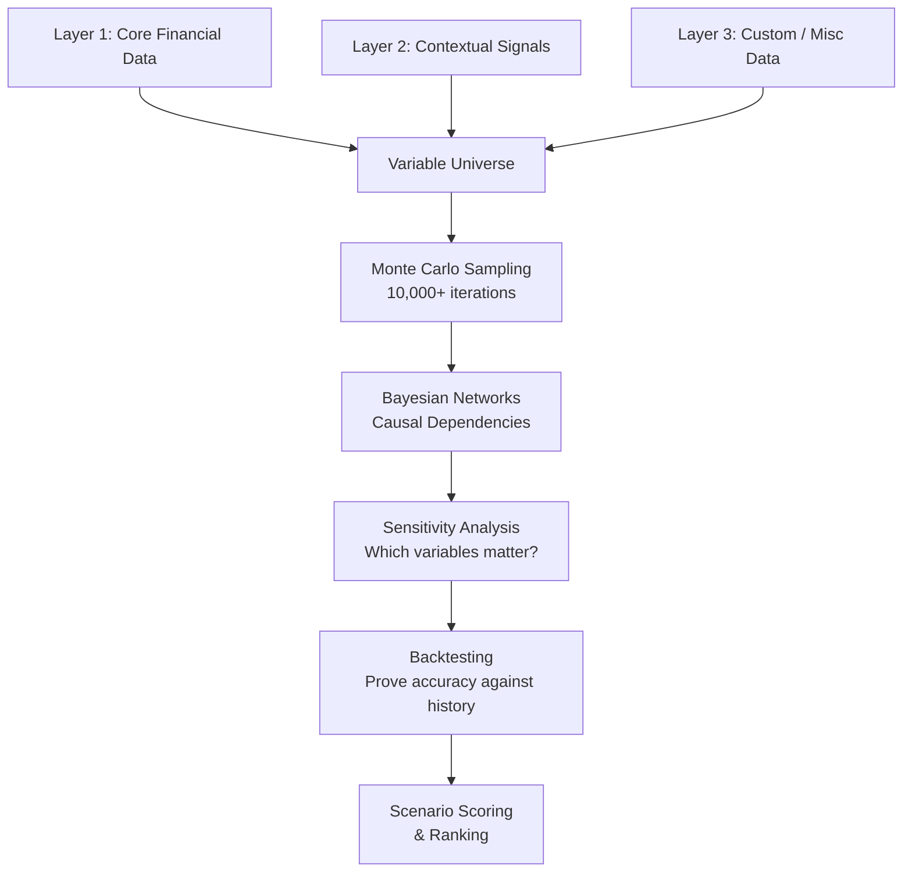

# OptX — Agent + Math Business Simulator

An AI-powered platform that ingests company data across financial, contextual, and custom dimensions, runs multi-agent simulations through a rigorous mathematical pipeline, and presents interactive optimization scenarios through an n8n-style node graph editor.

---

## Tech Stack

| Layer | Technology | Rationale |
|-------|-----------|-----------|
| **Framework** | Next.js 16 (App Router, TypeScript) | Full-stack, SSR, API routes |
| **Graph Editor** | React Flow (`@xyflow/react`) | n8n-style node-based UI |
| **Charts** | Recharts | Financial charts, confidence intervals |
| **State** | Zustand | Lightweight, perfect for graph + simulation state |
| **Styling** | Vanilla CSS (custom design system) | Premium dark-mode UI |
| **Simulation** | TypeScript (browser) + Python (server) | Monte Carlo, Bayesian, RL on server |
| **AI** | Claude API (via Anthropic SDK) | Chat, scenario generation, analysis |
| **Database** | SQLite (via better-sqlite3) for MVP | Simple local persistence |

---

## Mathematical Model Architecture

> [!IMPORTANT]
> This is the intellectual core of OptX. The math model doesn't just run on financial data — it operates on a **unified variable universe** built from every data layer the user provides.

### What Does Monte Carlo Actually Run On?

Monte Carlo runs on **everything** — but intelligently layered, not naively dumped together:



### The 5-Layer Math Pipeline

#### 1. Variable Universe Construction
Every piece of ingested data becomes a **variable** with a probability distribution:
- Financial data → empirical distributions from historical periods
- Interest rates → pulled from Fed data, modeled as mean-reverting process
- Market sentiment → ordinal scale (1-10), modeled with bounded distributions
- Brand/public image → proxy metrics (NPS scores, social mentions), Beta distribution
- Custom data → AI-assisted distribution fitting based on user's prompt description

#### 2. Monte Carlo Simulation (Uncertainty Quantification)
Samples from the **joint probability distribution** of ALL variables simultaneously:
- Each iteration = one possible future state of the entire business
- Variables are **not independent** — correlations are preserved via copulas
- Revenue doesn't just vary randomly; it co-varies with market sentiment, competition, interest rates
- Output: distribution of outcomes (P5, P25, P50, P75, P95) for every metric

#### 3. Bayesian Network (Causal Structure)
A directed acyclic graph (DAG) that encodes **cause → effect** relationships:
- `Interest Rate ↑` → `Debt Cost ↑` → `Cash Flow ↓` → `Growth Capacity ↓`
- `Marketing Spend ↑` → `Brand Awareness ↑` → `Customer Acquisition ↑` → `Revenue ↑`
- Learned from data + domain knowledge from AI agents
- Updated continuously as new data arrives (Bayesian posterior updates)

#### 4. Sensitivity Analysis (What Actually Matters)
Mathematical proof of which variables drive outcomes:
- **Sobol Indices** — decompose output variance into contributions from each input variable. "Your net income is 40% driven by raw material costs and only 5% by social media"
- **Morris Method** — screen out variables that have negligible effect, saving compute
- **SHAP-style attribution** — for each scenario, explain WHY it scored the way it did

#### 5. Backtesting & Cross-Validation (Accuracy Proof)
How we mathematically prove the model works:
- **Walk-forward validation**: if user has 3 years of data, train on years 1-2, predict year 3, compare
- **Prediction intervals**: track what % of actual outcomes fall within our confidence bands (calibration)
- **Brier scores**: for probabilistic predictions, how well-calibrated are our confidence levels?
- **Ensemble disagreement**: run multiple model variants, measure consensus — high disagreement = low confidence, honestly reported

### Additional Mathematical Approaches

| Method | Purpose | When Used |
|--------|---------|-----------|
| **Copula Functions** | Model dependencies between variables | Monte Carlo sampling |
| **GARCH Models** | Capture volatility clustering in financial data | Time-series forecasting |
| **Reinforcement Learning** | Agents learn optimal strategies over time | Agent behavior evolution |
| **Information Theory (Mutual Information)** | Quantify how much each data source contributes | Data layer importance scoring |
| **Bootstrap Resampling** | Estimate confidence intervals when data is limited | Small business with few data points |

---

## Project Structure

```
optX/
├── app/
│   ├── layout.tsx              # Root layout with sidebar nav
│   ├── page.tsx                # Landing / Dashboard
│   ├── globals.css             # Design system
│   ├── data/
│   │   └── page.tsx            # Data Ingestion — clickable box UI
│   ├── simulate/
│   │   └── page.tsx            # Simulation hub
│   ├── scenario/[id]/
│   │   └── page.tsx            # Scenario graph editor
│   ├── report/[id]/
│   │   └── page.tsx            # Deep-dive report
│   └── api/
│       ├── data/route.ts       # Upload & parse data
│       ├── simulate/route.ts   # Run simulation
│       ├── scenario/route.ts   # CRUD scenarios
│       └── chat/route.ts       # AI chat
├── components/
│   ├── layout/                 # Sidebar, TopBar
│   ├── data/                   # Data ingestion components
│   │   ├── DataBoxGrid.tsx     # Clickable box grid
│   │   ├── DataBox.tsx         # Individual data category box
│   │   ├── CustomDataBox.tsx   # Custom prompt + upload box
│   │   ├── FileUploader.tsx    # CSV/Excel upload
│   │   ├── ManualEntry.tsx     # Form-based entry
│   │   └── DataPreview.tsx     # Preview uploaded data
│   ├── graph/                  # n8n-style editor
│   ├── chat/                   # AI chat panel
│   ├── report/                 # Charts & breakdowns
│   └── ui/                     # Shared UI primitives
├── lib/
│   ├── engine/                 # Math pipeline
│   │   ├── variableUniverse.ts # Build unified variable set
│   │   ├── monteCarlo.ts       # MC sampling with copulas
│   │   ├── bayesian.ts         # Bayesian network & updates
│   │   ├── sensitivity.ts      # Sobol, Morris, SHAP
│   │   ├── backtest.ts         # Walk-forward validation
│   │   ├── agents.ts           # Multi-agent system
│   │   └── scenario.ts         # Scenario generation
│   ├── data/                   # Parsing, normalization
│   ├── store/                  # Zustand stores
│   └── types/                  # TypeScript types
└── package.json
```

---

## Proposed Changes

### Phase 1 — Foundation & Data Ingestion

#### [NEW] Project Scaffold

Initialize Next.js 16 with TypeScript, install all dependencies.

#### [NEW] [globals.css](file:///Users/krishgarg/Documents/Projects/optX/app/globals.css)

Premium dark-mode design system with glassmorphism, gradient accents, micro-animations.

#### [NEW] [layout.tsx](file:///Users/krishgarg/Documents/Projects/optX/app/layout.tsx)

Root layout with sidebar nav (Data → Simulate → Reports), top bar, Inter font.

#### [NEW] [page.tsx](file:///Users/krishgarg/Documents/Projects/optX/app/page.tsx)

Dashboard: data status, active scenarios, recent results, quick actions.

#### [NEW] Data Ingestion Page — [data/page.tsx](file:///Users/krishgarg/Documents/Projects/optX/app/data/page.tsx)

Two-step flow:

**Step 1: Company Profile** — name, industry, size, fiscal year

**Step 2: Data Sources** — A grid of clickable boxes organized in 3 tiers:

**Tier 1 — Core Financial (required)**
| Box | Data | Upload Format |
|-----|------|--------------|
| 📊 Balance Sheet | Assets, Liabilities, Equity | CSV, Excel, Manual |
| 📈 Income Statement | Revenue → Net Income | CSV, Excel, Manual |
| 💰 Cash Flow Statement | Operating, Investing, Financing | CSV, Excel, Manual |
| 📒 General Ledger | Journal entries, accounts | CSV, Excel |
| 🛒 POS / Transactions | Sales data: time, date, amount, type | CSV, POS export |

**Tier 2 — Contextual Signals (optional, improves accuracy)**
| Box | Data | How It Helps |
|-----|------|-------------|
| 📉 Interest Rates | Current rates, Fed projections | Debt cost modeling, borrowing scenarios |
| 📊 Market Sentiment | Industry outlook, consumer confidence | Demand forecasting |
| 💹 Inflation Data | CPI, PPI, sector-specific inflation | Cost projection, pricing strategy |
| 🏷️ Brand & Public Image | NPS scores, reviews, social mentions | Revenue velocity, customer retention |
| 👥 Market Demographics | Target market size, age, income, geo | Addressable market, expansion scenarios |
| 🏢 Competition Data | Competitor pricing, market share, moves | Competitive positioning |
| 📦 Supply Chain / Materials | Supplier costs, lead times, availability | COGS forecasting, risk assessment |
| 👨‍💼 Workforce Data | Headcount, payroll, turnover, hiring plans | OpEx modeling, capacity planning |
| 📣 Marketing Performance | CAC, channels, conversion rates, spend | ROI optimization, growth modeling |
| 🏦 Debt & Loan Schedules | Outstanding loans, rates, maturity dates | Cash flow impact, refinancing scenarios |

**Tier 3 — Custom Data**
| Box | Description |
|-----|-------------|
| ✏️ **Custom** | User types a prompt describing what miscellaneous document/data they're attaching (e.g., "these are our franchise agreement terms" or "this is our patent portfolio valuation"). AI processes the prompt to understand context and extract relevant variables for the simulation model. |

Each box:
- Starts grayed out / outlined
- Glows / fills with color when clicked (selected)
- Expands to show upload area + optional manual entry
- Shows a checkmark + summary when data is provided
- Can be removed/cleared

The Custom box has a text input for the prompt + a file upload. Multiple custom boxes can be added.

#### [NEW] Data Types — [lib/types/financial.ts](file:///Users/krishgarg/Documents/Projects/optX/lib/types/financial.ts)

Extended types covering all 3 tiers:

```typescript
interface CompanyData {
  profile: CompanyProfile;
  financial: {
    balanceSheet?: BalanceSheet[];
    incomeStatement?: IncomeStatement[];
    cashFlow?: CashFlowStatement[];
    generalLedger?: JournalEntry[];
    transactions?: Transaction[];
  };
  contextual: {
    interestRates?: InterestRateData;
    marketSentiment?: SentimentData;
    inflation?: InflationData;
    brand?: BrandData;
    demographics?: DemographicData;
    competition?: CompetitionData;
    supplyChain?: SupplyChainData;
    workforce?: WorkforceData;
    marketing?: MarketingData;
    debt?: DebtSchedule[];
  };
  custom: CustomDataSource[];
}

interface CustomDataSource {
  id: string;
  prompt: string;           // User's description of what this data is
  fileName: string;
  rawData: any;
  extractedVariables: Variable[];  // AI-extracted variables
  confidence: number;        // How confident we are in the extraction
}
```

---

### Phase 2 — Simulation Engine

#### [NEW] [variableUniverse.ts](file:///Users/krishgarg/Documents/Projects/optX/lib/engine/variableUniverse.ts)

Build the unified variable set from all data layers. Each variable gets:
- A probability distribution (empirical, normal, beta, etc.)
- A correlation matrix linking it to other variables
- A confidence weight (core financial = high, custom = lower until validated)
- Time-series behavior (trend, seasonality, volatility)

#### [NEW] [monteCarlo.ts](file:///Users/krishgarg/Documents/Projects/optX/lib/engine/monteCarlo.ts)

Samples from joint distribution of ALL variables using copulas to preserve correlations. 10,000+ iterations. Parallel via Web Workers.

#### [NEW] [bayesian.ts](file:///Users/krishgarg/Documents/Projects/optX/lib/engine/bayesian.ts)

Bayesian DAG encoding causal relationships. Posterior updates as new data arrives.

#### [NEW] [sensitivity.ts](file:///Users/krishgarg/Documents/Projects/optX/lib/engine/sensitivity.ts)

Sobol indices + Morris method. Outputs: "your outcome is X% driven by variable Y."

#### [NEW] [backtest.ts](file:///Users/krishgarg/Documents/Projects/optX/lib/engine/backtest.ts)

Walk-forward validation, calibration scoring, Brier scores. Produces an **Accuracy Report** that users can see: "our model predicted within ±5% of actual results for 87% of test periods."

#### [NEW] [agents.ts](file:///Users/krishgarg/Documents/Projects/optX/lib/engine/agents.ts)

6 agent types (Market, Financial, Growth, Risk, Brand, Operations). Resource allocation function dynamically assigns agents based on uncertainty.

---

### Phase 3 — Scenario Graph UI (n8n-style)

Three-panel layout: Left (Node Palette) → Center (React Flow Canvas) → Right (AI Chat)

Node categories: Financial, Market, Brand, Operations, Logic, Metrics. Each node is draggable, editable, removable. Edges represent data flow with labeled relationships.

---

### Phase 4 — AI Chat & Interaction

Right-side chat panel. Context-aware "what if" modifications. Streams from Claude. Can modify scenario graph in real-time.

---

### Phase 5 — Reports & Financial Breakdown

Deep-dive reports per simulation: fan charts (confidence intervals), tornado charts (sensitivity), waterfall charts (P&L breakdown), scenario comparison tables. Includes the **Accuracy Report** from backtesting.

---

### Phase 6 — Action Guidance (Future)

Scenario selection → AI-generated step-by-step business improvement plans → progress tracking.

---

## User Review Required

> [!IMPORTANT]
> **Starting Point**: I'll build Phase 1 (Foundation + Data Ingestion with the clickable-box UI) first. The data layer is the foundation everything else depends on. Good to start here?

> [!IMPORTANT]
> **Math Pipeline Depth for MVP**: The full 5-layer math pipeline is the end goal. For the MVP build, I'll implement Monte Carlo + sensitivity analysis first, then layer in Bayesian networks and backtesting. This lets us show real value quickly while building mathematical rigor over time.

---

## Verification Plan

### Build Verification
- `npm run build` — no TypeScript errors
- `npm run dev` — dev server on localhost:3000

### Browser Testing (Phase 1)
1. Dashboard renders with premium dark UI
2. Data page shows clickable box grid with all 3 tiers
3. Clicking a box expands it with upload/entry options
4. Custom box accepts prompt text + file upload
5. File uploads parse correctly (CSV, Excel)
6. Data preview shows parsed results
7. Multiple custom boxes can be added
8. Responsive layout at various widths
