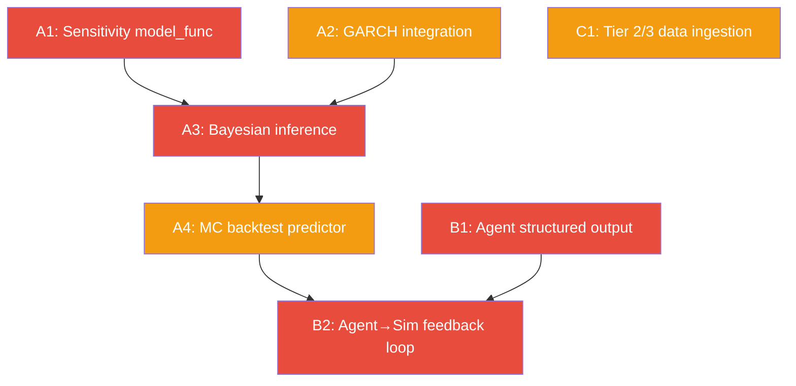

# OptX Model Progress Report — 2026-02-25

Status: Active
Owner: Engineering
Purpose: Codex handoff — complete audit of simulation/math/AI model layer

---

## 1) Architecture Overview

Two-service architecture: Next.js frontend + Python FastAPI backend.

All math and AI logic runs server-side in `python/`. The frontend calls `/simulate`, `/agents/analyze`, `/chat`, and `/extract-variables` via Next.js API route proxies.

```
Browser → Next.js API routes → Python FastAPI
                                 ├── engine/   (pure math, no AI)
                                 └── agents/   (AI-powered analysis)
```

**AI provider**: OpenAI (`gpt-4o` for agents + general chat, `gpt-4o-mini` for scenario parsing)

---

## 2) What's Built — Engine Layer (`python/engine/`)

### ✅ variable_universe.py (281 lines) — COMPLETE

Converts raw business data into typed `Variable` objects with probability distributions.

**Working features:**
- 7 distribution types: Normal, Lognormal, Beta, Uniform, Empirical, Poisson, Triangular
- `Distribution.sample(n)` — samples from any distribution with fallback handling
- `VariableUniverse.fit_distribution()` — auto-fits distribution to observed data
- `VariableUniverse.build_correlation_matrix()` — builds Pearson correlation from time-series data
- `VariableUniverse.from_business_data(dict)` — parses revenue, expenses, cash, debt into variables
- Each variable carries: id, name, display_name, category, value, unit, distribution, confidence, time_series_data, source

**Known limitations:**
- `from_business_data()` only handles basic fields: `monthly_revenue`, `expenses`, `cash_on_hand`, `outstanding_debt`
- Does NOT yet process Tier 2 contextual data (interest rates, market sentiment, inflation, brand, demographics, competition, supply chain, workforce, marketing, debt schedules)
- Does NOT yet process Tier 3 custom data (user-prompted miscellaneous documents)
- Correlation matrix requires time-series data; single-value variables get no correlation linkage
- No copula-based dependency modeling here (that's deferred to Monte Carlo)

---

### ✅ monte_carlo.py (221 lines) — COMPLETE

10,000+ iteration Monte Carlo with Gaussian copula for correlation.

**Working features:**
- `MonteCarloEngine.__init__(universe, iterations=10000)`
- `_generate_correlated_uniforms()` — Gaussian copula via Cholesky decomposition of correlation matrix; falls back to independent sampling if no correlation matrix
- `_sample_from_uniforms()` — inverse CDF mapping for all 7 distribution types
- `run(time_horizon_months=12, include_raw_samples=False)` — full simulation producing per-variable `MonteCarloResult` with:
  - mean, median, std
  - percentiles: P5, P25, P50, P75, P95
  - `time_series_projection`: month-by-month projections with trend/noise
  - optional raw_samples for debugging

**Known limitations:**
- Only Gaussian copula — no t-copula or vine copulas for tail dependency
- Time-series projection uses simple linear trend + random noise; no ARIMA, no seasonality detection
- No drift/mean-reversion modeling
- Scenario overrides create point distributions (same value repeated), which defeats the purpose of Monte Carlo for those variables

---

### ⚠️ bayesian.py (127 lines) — STRUCTURAL ONLY

DAG construction works. Inference is stubbed.

**Working features:**
- `BayesianEngine` with `add_node()`, `add_edge()` — builds directed acyclic graph
- `build_default_structure(variables)` — 8 hardcoded causal edges:
  - `monthly_revenue → gross_profit` (0.9)
  - `COGS → gross_profit` (-0.8)
  - `gross_profit → net_income` (0.85)
  - `Payroll → net_income` (-0.7)
  - `Rent → net_income` (-0.5)
  - `Marketing → monthly_revenue` (0.4)
  - `outstanding_debt → cash_on_hand` (-0.6)
  - `net_income → cash_on_hand` (0.8)
- Variable name resolution with alias mapping (handles camelCase/snake_case/display names)

**What's NOT working:**
- `infer()` returns **stub posteriors** — every node gets `{"stub": True, "type": "normal", "params": {"mean": 0.0, "std": 1.0}}`
- No actual Bayesian inference (no pgmpy, no variable elimination, no belief propagation)
- No posterior updates when new data arrives
- No AI-assisted structure learning — only hardcoded edges
- DAG is disconnected from Monte Carlo results (doesn't inform sampling)

---

### ✅ sensitivity.py (142 lines) — COMPLETE

Sobol indices + Morris screening method.

**Working features:**
- `sobol_analysis(model_func, variable_names, bounds, n_samples=1024)` — full Saltelli sampling with:
  - First-order Sobol indices
  - Total Sobol indices
  - Variable ranking by impact
  - Handles edge cases: zero variance, 50+ variables (auto-reduces samples)
- `morris_screening(model_func, variable_names, bounds, n_trajectories=10, delta=0.1)` — elementary effects method
- Results combined: each variable gets `sobol_index`, `total_sobol_index`, `morris_screening`, `rank`

**Known limitations:**
- `model_func` in `/simulate` is hardcoded as `revenue - sum(expenses)` — trivial linear model
- Does not use the actual Monte Carlo model function or Bayesian network for sensitivity
- No SHAP-style attribution (planned in `plan.md` but not implemented)

---

### ✅ backtest.py (149 lines) — COMPLETE

Walk-forward validation with calibration scoring.

**Working features:**
- `walk_forward_validation(historical_data, prediction_func, window_size=6, step_size=1)` — expanding-window backtesting
- Computes: accuracy (1 - MAPE), mean_squared_relative_error, calibration_data (binned predicted vs actual), walk_forward_results
- `compute_ensemble_disagreement(predictions)` — coefficient of variation across ensemble members
- `_compute_calibration()` — bins predictions and computes calibration curve

**Known limitations:**
- `prediction_func` in `/simulate` is `trailing_mean_baseline` — just averages training data; not connected to Monte Carlo model
- No Brier scores (mentioned in plan, not implemented)
- Requires monthly_revenue time-series; returns empty/zero results if insufficient historical data
- No cross-validation (only walk-forward)
- Ensemble disagreement not actually used (no ensemble of models runs)

---

### 🧪 garch.py (109 lines) — EXPERIMENTAL, NOT INTEGRATED

GARCH(1,1) volatility modeling.

**Working features:**
- `GARCHEngine.fit(returns)` — simplified MLE grid search over α, β parameters
- `GARCHEngine.forecast(result, n_periods=12)` — forward volatility forecasting
- Handles edge cases (n < 10 data points)
- Computes conditional volatility series

**What's NOT integrated:**
- Not imported in `main.py`
- Not used in the `/simulate` pipeline
- Not connected to Monte Carlo (could feed volatility estimates into distribution params)
- Not connected to Variable Universe (could set distribution std from GARCH forecast)

---

## 3) What's Built — Agent Layer (`python/agents/`)

### ✅ base.py (120 lines) — COMPLETE

Abstract base class for all agents.

- `BaseAgent.__init__(agent_type, system_prompt)` — initializes OpenAI client with `gpt-4o`
- `_call_llm(prompt, max_tokens=4096)` — calls OpenAI with system prompt; returns stub if no API key
- `_build_data_context(business_data, simulation_data)` — builds text summary of business data for LLM context
- `AgentFinding` dataclass: summary, details, confidence, supporting_data, suggested_variables, suggested_edges
- `AgentAnalysis` dataclass: agent_type, findings, scenario_suggestions
- `AIServiceError` exception class

### ✅ 6 Specialized Agents — COMPLETE (all follow same pattern)

| File | Agent | Focus Areas |
|------|-------|-------------|
| `market.py` (66 lines) | MarketAgent | Market size, competitive dynamics, demand drivers, pricing power |
| `financial.py` (67 lines) | FinancialAgent | Profitability ratios, liquidity, leverage, cash flow, burn rate |
| `growth.py` | GrowthAgent | Growth opportunities, scalability, expansion scenarios |
| `risk.py` (66 lines) | RiskAgent | Operational/financial/strategic/external risks, tail risks |
| `brand.py` | BrandAgent | Brand perception, reputation, customer loyalty |
| `operations.py` | OperationsAgent | Efficiency, capacity, supply chain, workforce optimization |

**Current agent behavior:**
- Each agent has `analyze()` and `critique()` methods
- `analyze()` builds a context string from business data, sends to LLM, wraps response in a **single** `AgentFinding` with the entire LLM response as `details`
- `critique()` takes another agent's analysis and returns free-text critique
- Agents do NOT parse structured output from the LLM — findings are raw text
- Agents do NOT populate `suggested_variables` or `suggested_edges` (always empty lists)
- Agents do NOT populate `scenario_suggestions` (always empty list)

### ✅ coordinator.py (243 lines) — COMPLETE

Orchestrates 6-agent pipeline.

**Working features:**
- Parallel execution via `asyncio.gather()` with semaphore (max 4 concurrent API calls)
- 2-3 debate rounds with defined critique pairs:
  - Risk ↔ Growth, Financial ↔ Market, Operations ↔ Growth
  - Risk ↔ Financial, Market ↔ Brand, Growth ↔ Operations
- Convergence detection (critique length reduction between rounds)
- `_aggregate_findings()` — merges all findings sorted by confidence, deduplicates suggestions
- Graceful error handling — failed agents don't crash the pipeline

---

## 4) What's Built — Pipeline Orchestration (`main.py` `/simulate` route)

The `/simulate` endpoint (lines 251-345) runs the full 5-layer pipeline:

```python
1. _normalize_business_data(request.business_data)     # Parse input
2. VariableUniverse().from_business_data(data)          # Build variable set
3. _apply_scenario_overrides(universe, scenario_vars)   # Apply what-if tweaks
4. MonteCarloEngine(universe).run()                     # 10K iterations
5. BayesianEngine().build_default_structure().infer()   # DAG (stubbed inference)
6. SensitivityEngine().sobol_analysis()                 # Variable importance
7. BacktestEngine().walk_forward_validation()           # Accuracy check
```

**Helper functions:**
- `_normalize_business_data()` — handles camelCase/snake_case field names
- `_apply_scenario_overrides()` — adds scenario variables to universe (with node-id normalization)
- `_build_sensitivity_bounds()` — ±20% range around each variable's base value
- `_build_backtest_history()` — extracts monthly_revenue as time-series

---

## 5) What's NOT Built — The Gaps

### Gap 1: Bayesian Inference (HIGH PRIORITY)

**Current**: DAG structure exists but `infer()` returns stubs.
**Target**: Full probabilistic inference so the Bayesian network actually informs predictions.

**Implementation plan:**
1. Add `pgmpy` to `requirements.txt`
2. Convert `BayesianEngine` edges into a `pgmpy.models.BayesianNetwork`
3. Use `MaximumLikelihoodEstimator` or `BayesianEstimator` to learn CPDs from Monte Carlo samples
4. Implement `VariableElimination` or `BeliefPropagation` for queries
5. Return real posteriors: P(net_income | marketing_spend=X, interest_rate=Y)
6. Feed posteriors back into the `/simulate` response payload

**Files to modify:**
- `python/engine/bayesian.py` — replace `infer()` stub
- `python/requirements.txt` — add `pgmpy`
- `python/main.py` (lines 276-288) — pass Monte Carlo results to Bayesian engine for CPD learning

---

### Gap 2: GARCH Integration (MEDIUM PRIORITY)

**Current**: `garch.py` exists but is not imported or used anywhere.
**Target**: Use GARCH volatility estimates to improve Monte Carlo sampling.

**Implementation plan:**
1. In `/simulate`, after building `VariableUniverse`, check if any variable has time-series data
2. For variables with sufficient history (≥10 points), compute returns and fit GARCH
3. Use GARCH-forecast volatility to update the variable's `distribution.params["std"]`
4. This makes Monte Carlo sampling more realistic — periods of high volatility get wider spreads

**Files to modify:**
- `python/main.py` — import `GARCHEngine`, add integration step between universe construction and Monte Carlo
- `python/engine/variable_universe.py` — add method to update distribution params from GARCH output

---

### Gap 3: Realistic Sensitivity Model Function (HIGH PRIORITY)

**Current**: `model_func` in `/simulate` is `revenue - sum(expenses)` — trivial linear model.
**Target**: Build a model function from the Bayesian DAG or Variable Universe that captures nonlinear relationships.

**Implementation plan:**
1. Build `model_func` from the Bayesian network's edge structure
2. For each variable, apply the causal weights from connected edges
3. This makes Sobol indices meaningful — they'll reflect actual business dynamics, not linear subtraction

**Files to modify:**
- `python/main.py` (lines 295-302) — replace hardcoded `model_func` with DAG-driven function
- Possibly `python/engine/sensitivity.py` — add helper for building model functions from DAGs

---

### Gap 4: Backtest Predictor Integration (MEDIUM PRIORITY)

**Current**: `prediction_func` is `trailing_mean_baseline` — just averages training data.
**Target**: Use Monte Carlo or a fitted model as the predictor so backtesting actually validates the simulation engine.

**Implementation plan:**
1. Build a predictor that uses the Monte Carlo engine: given training data → build universe → run MC → return median projection
2. This closes the loop: backtest validates whether the MC engine produces accurate forecasts
3. Add Brier scores for probabilistic predictions (check if actual outcomes fall within confidence intervals)

**Files to modify:**
- `python/main.py` (lines 317-320) — replace predictor with MC-based predictor
- `python/engine/backtest.py` — add `compute_brier_score()` method

---

### Gap 5: Agent Structured Output (HIGH PRIORITY)

**Current**: All 6 agents return a single `AgentFinding` with raw LLM text as `details`. `suggested_variables`, `suggested_edges`, and `scenario_suggestions` are always empty.
**Target**: Agents return structured, machine-readable output that feeds back into the simulation.

**Implementation plan:**
1. Update each agent's system prompt to require JSON-structured responses
2. Add response parsing in `BaseAgent._call_llm()` or a new `_call_llm_structured()` method
3. Parse LLM response into multiple `AgentFinding` objects with:
   - Individual `summary` per finding
   - `confidence` per finding (not one default)
   - Populated `suggested_variables` (variables the agent thinks are missing from the universe)
   - Populated `suggested_edges` (causal relationships to add to the Bayesian network)
4. Parse `scenario_suggestions` — concrete what-if scenarios the agent recommends simulating
5. Consider using OpenAI's structured output / function calling / JSON mode for reliability

**Files to modify:**
- `python/agents/base.py` — add `_call_llm_structured()` with JSON schema enforcement
- All 6 agent files — update system prompts and `analyze()` to use structured output
- `python/agents/coordinator.py` — aggregate `suggested_variables` and `suggested_edges` into the coordinator output

---

### Gap 6: Agent → Simulation Feedback Loop (HIGH PRIORITY)

**Current**: Agents analyze business data and simulation results, but their suggestions are NOT fed back into the simulation engine. It's a one-way street.
**Target**: Agent findings should inform the Variable Universe and Bayesian Network.

**Implementation plan:**
1. After agent analysis, extract `suggested_variables` → add to Variable Universe
2. Extract `suggested_edges` → add to Bayesian Network DAG
3. Optionally re-run Monte Carlo with the enriched universe (agent-enhanced simulation)
4. This creates the AI + Math feedback loop: Math produces results → AI agents analyze → AI suggestions improve the math model

**Depends on**: Gap 5 (agents must produce structured output first)

**Files to modify:**
- `python/main.py` — add post-agent enrichment step
- `python/engine/variable_universe.py` — add method to merge agent-suggested variables
- `python/engine/bayesian.py` — add method to merge agent-suggested edges

---

### Gap 7: Reinforcement Learning (LOW PRIORITY — future phase)

**Current**: Not implemented at all.
**Target (from plan.md)**: Agents learn optimal strategies over time via RL.

This is a large feature. For now, defer to a future phase. When implemented:
- Each agent could use RL to learn which findings are most actionable
- Simulation scenarios could be optimized via policy gradient methods
- Requires a reward signal (e.g., backtest accuracy improvement)

---

### Gap 8: Information Theory — Mutual Information (LOW PRIORITY)

**Current**: Not implemented.
**Target (from plan.md)**: Quantify how much each data source (Tier 1/2/3) contributes to prediction accuracy.

**Implementation plan:**
1. Add `information_theory.py` to `python/engine/`
2. Compute mutual information between each input variable and key outputs
3. Score data layers: "Financial data contributes 60% of prediction power, contextual signals add 25%, custom data adds 15%"
4. Use this to guide users on which data to provide

---

### Gap 9: Tier 2 and Tier 3 Data Ingestion into Variable Universe (MEDIUM PRIORITY)

**Current**: `from_business_data()` only handles: `monthly_revenue`, `expenses`, `cash_on_hand`, `outstanding_debt`.
**Target**: Process all Tier 2 contextual data and Tier 3 custom data into variables.

**Implementation plan:**
1. Extend `_normalize_business_data()` to pass through contextual fields
2. Extend `from_business_data()` to process:
   - Interest rates → mean-reverting process distribution
   - Market sentiment → bounded distribution (1-10 scale)
   - Inflation data → Normal distribution from CPI data
   - Brand/NPS → Beta distribution
   - Demographics → population-weighted distributions
   - Competition data → relative market share variables
   - Supply chain → cost/lead-time distributions
   - Workforce → headcount/payroll/turnover variables
   - Marketing → CAC/conversion variables
   - Debt schedules → cash flow impact variables
3. For Tier 3 custom data, use AI (OpenAI) to interpret the user's prompt and extract variables from the uploaded file

**Files to modify:**
- `python/main.py` — extend `_normalize_business_data()`
- `python/engine/variable_universe.py` — extend `from_business_data()` with tier-2/3 parsers

---

### Gap 10: Advanced Copula Functions (LOW PRIORITY)

**Current**: Only Gaussian copula.
**Target**: t-copula for tail dependencies, vine copulas for complex dependency structures.

---

## 6) Priority Order for Codex

> [!IMPORTANT]
> The following order maximizes impact and respects dependencies.

### Phase A — Fix the Math Core (do first)

| # | Gap | Priority | Effort | Why First |
|---|-----|----------|--------|-----------|
| A1 | Gap 3: Realistic sensitivity model_func | HIGH | Small | Makes sensitivity results meaningful |
| A2 | Gap 2: GARCH integration | MEDIUM | Small | Improves MC sampling quality |
| A3 | Gap 1: Bayesian inference | HIGH | Medium | Completes the 5-layer pipeline |
| A4 | Gap 4: MC-based backtest predictor | MEDIUM | Small | Makes backtest results meaningful |

### Phase B — Fix the AI Layer (do second)

| # | Gap | Priority | Effort | Why Second |
|---|-----|----------|--------|------------|
| B1 | Gap 5: Agent structured output | HIGH | Medium | Required before agents can feed back into simulation |
| B2 | Gap 6: Agent → Simulation feedback loop | HIGH | Medium | Creates the AI+Math loop |

### Phase C — Expand Data Support (do third)

| # | Gap | Priority | Effort | Why Third |
|---|-----|----------|--------|-----------|
| C1 | Gap 9: Tier 2/3 data ingestion | MEDIUM | Large | Needs math core working first |

### Phase D — Advanced Features (future)

| # | Gap | Priority | Effort |
|---|-----|----------|--------|
| D1 | Gap 8: Information theory | LOW | Medium |
| D2 | Gap 10: Advanced copulas | LOW | Medium |
| D3 | Gap 7: Reinforcement learning | LOW | Large |

---

## 7) Codex Task Prompts

Below are self-contained prompts ready for Codex. Each task is scoped to specific files with clear input/output expectations.

---

### Task A1: Replace Hardcoded Sensitivity Model Function

**Objective**: Replace the trivial `revenue - sum(expenses)` model function in `/simulate` with a DAG-driven function built from the Bayesian network's causal structure.

**Files to modify:**
- `python/main.py` (lines 293-309)

**Instructions:**
1. After `bayesian_engine.build_default_structure(universe.variables)` (line 277), extract edges from `bayesian_engine.edges`
2. Build a `model_func(values)` that uses the causal edge weights to compute a weighted combination of variables, respecting the DAG structure
3. Map each variable in `universe.variables` to its index in the values array
4. For each edge `(from_var, to_var, strength)`, apply: `contribution[to_var] += values[from_idx] * strength`
5. Return the sum of all terminal node contributions (nodes with no outgoing edges)
6. Falls back to current `revenue - expenses` if no Bayesian edges exist

**Do NOT change:** Any engine files, API contracts, or other routes.

---

### Task A2: Integrate GARCH into Simulation Pipeline

**Objective**: Use GARCH volatility forecasts to improve Monte Carlo distribution parameters for variables with sufficient time-series history.

**Files to modify:**
- `python/main.py` — add GARCH integration step between universe construction (line 263) and Monte Carlo execution (line 266)

**Instructions:**
1. Import `GARCHEngine` from `engine.garch`
2. After `universe.from_business_data(business_data)`, iterate over variables with `time_series_data`
3. For variables with ≥10 data points, compute period-over-period returns
4. Fit GARCH(1,1) via `GARCHEngine().fit(returns)`
5. Forecast 1-period-ahead volatility
6. Update the variable's `distribution.params["std"]` with the GARCH-forecast volatility (scale appropriately to match the variable's units)
7. Proceed with Monte Carlo as before — it now uses GARCH-informed volatility

**Do NOT change:** `garch.py` internals, other engine files, API contracts.

---

### Task A3: Implement Real Bayesian Inference with pgmpy

**Objective**: Replace the stub `infer()` method in `BayesianEngine` with actual probabilistic inference using pgmpy.

**Files to modify:**
- `python/engine/bayesian.py` — replace `infer()` method
- `python/requirements.txt` — add `pgmpy>=0.1.25`
- `python/main.py` (lines 276-288) — pass Monte Carlo samples to Bayesian engine

**Instructions:**
1. Add `pgmpy` to requirements
2. In `bayesian.py`, add a method `fit_from_samples(samples: dict[str, list[float]])` that:
   - Creates a `pgmpy.models.BayesianNetwork` from existing edges
   - Discretizes continuous samples into bins (5-10 bins per variable)
   - Fits CPDs using `MaximumLikelihoodEstimator`
3. Update `infer()` to:
   - Use `VariableElimination` to compute posteriors for each node
   - Return real posterior distributions instead of stubs
4. In `main.py`, after Monte Carlo completes, extract samples and call `bayesian_engine.fit_from_samples(mc_samples)`
5. Wrap all pgmpy operations in try/except — fall back to current stub behavior if pgmpy fails

**Do NOT change:** DAG structure logic, add_node/add_edge behavior, API response format.

---

### Task A4: MC-Based Backtest Predictor + Brier Scores

**Objective**: Replace the trailing-mean baseline predictor with a Monte Carlo-based predictor and add Brier score computation.

**Files to modify:**
- `python/main.py` (lines 313-328) — replace prediction_func
- `python/engine/backtest.py` — add `compute_brier_score()` method

**Instructions:**
1. Build a predictor that: takes training data → builds a mini VariableUniverse → runs MC with 1000 iterations → returns median projection
2. This is computationally heavier — limit MC iterations for backtest to 1000 and window to match available data
3. Add `compute_brier_score()` that checks what percentage of actual values fall within the MC confidence intervals (P5-P95)
4. Include `brier_score` in `BacktestResult` (add field to dataclass)
5. Include predictor metadata: `{"predictor": "monte_carlo_1k", "brier_score": X}`

**Do NOT change:** The `BacktestResult` JSON key in the API response, or other pipeline steps.

---

### Task B1: Agent Structured Output with JSON Mode

**Objective**: Make all 6 agents return structured, machine-readable output instead of raw text.

**Files to modify:**
- `python/agents/base.py` — add `_call_llm_structured()` method
- `python/agents/market.py`, `financial.py`, `growth.py`, `risk.py`, `brand.py`, `operations.py` — update `analyze()` methods

**Instructions:**
1. In `base.py`, add `_call_llm_structured(prompt, response_schema: dict, max_tokens=4096)`:
   - Uses OpenAI's `response_format={"type": "json_object"}` parameter
   - Injects schema instructions into the prompt
   - Parses JSON response into structured findings
2. Define the expected JSON schema:
   ```json
   {
     "findings": [
       {
         "summary": "string",
         "details": "string",
         "confidence": 0.0-1.0,
         "supporting_data": ["string"],
         "suggested_variables": [
           {"name": "string", "display_name": "string", "category": "string", "suggested_value": 0, "unit": "string", "rationale": "string"}
         ],
         "suggested_edges": [
           {"from_var": "string", "to_var": "string", "strength": 0.0-1.0, "description": "string"}
         ]
       }
     ],
     "scenario_suggestions": ["string"]
   }
   ```
3. Update each agent's `analyze()` to call `_call_llm_structured()` instead of `_call_llm()`
4. Parse the JSON response into multiple `AgentFinding` objects (one per finding)
5. Populate `suggested_variables`, `suggested_edges`, `scenario_suggestions` from parsed JSON
6. Add robust fallback — if JSON parsing fails, fall back to current single-finding behavior

**Do NOT change:** `AgentFinding`/`AgentAnalysis` dataclass structure, coordinator logic, API response format.

---

### Task B2: Agent → Simulation Feedback Loop

**Objective**: Feed agent-suggested variables and edges back into the simulation engine for re-enriched results.

**Depends on**: Task B1 must be completed first.

**Files to modify:**
- `python/main.py` — add post-agent enrichment step
- `python/engine/variable_universe.py` — add `merge_agent_suggestions()` method
- `python/engine/bayesian.py` — add `merge_agent_edges()` method

**Instructions:**
1. In `main.py`, add a new endpoint or extend `/simulate` with an optional `include_agent_enrichment: bool` flag
2. If enabled, after initial simulation:
   a. Run agent analysis with simulation results
   b. Extract `suggested_variables` from all agent findings
   c. Call `universe.merge_agent_suggestions(suggested_variables)` — adds new variables with AI-suggested distributions
   d. Extract `suggested_edges` from all agent findings  
   e. Call `bayesian_engine.merge_agent_edges(suggested_edges)` — adds new causal relationships
   f. Re-run Monte Carlo with the enriched universe
   g. Return both original and enriched results
3. In `variable_universe.py`, implement `merge_agent_suggestions()`:
   - Validate suggested variables (name, value, category)
   - Assign lower confidence (0.5) to AI-suggested variables
   - Fit distributions based on suggested values
4. In `bayesian.py`, implement `merge_agent_edges()`:
   - Validate edge endpoints exist in the DAG
   - Skip duplicate edges

**Do NOT change:** The default `/simulate` behavior (enrichment is opt-in).

---

## 8) Dependency Graph



---

## 9) Test Verification for Each Task

After each task, verify:

```bash
# 1. No import errors
cd python && python -c "from engine.variable_universe import VariableUniverse; from engine.monte_carlo import MonteCarloEngine; from engine.bayesian import BayesianEngine; from engine.sensitivity import SensitivityEngine; from engine.backtest import BacktestEngine; from engine.garch import GARCHEngine; print('All imports OK')"

# 2. Server starts
uvicorn main:app --port 8000 &
sleep 3

# 3. Health check
curl http://localhost:8000/health

# 4. Simulate endpoint
curl -X POST http://localhost:8000/simulate \
  -H "Content-Type: application/json" \
  -d '{
    "businessId": "test-1",
    "config": {"iterations": 1000, "timeHorizonMonths": 6},
    "businessData": {
      "name": "Test Corp",
      "industry": "retail",
      "monthly_revenue": [50000, 52000, 48000, 55000, 53000, 51000, 54000, 56000, 49000, 52000, 55000, 57000],
      "expenses": [
        {"name": "Rent", "amount": 5000},
        {"name": "Payroll", "amount": 25000},
        {"name": "Marketing", "amount": 3000}
      ],
      "cash_on_hand": 100000,
      "outstanding_debt": 50000
    }
  }'

# 5. Verify response contains non-stub data
# - monte_carlo: check percentiles are different from each other
# - bayesian_network: check posteriors are NOT {"stub": true} (after A3)
# - sensitivity: check sobol_index values vary across variables (after A1)
# - backtest: check accuracy > 0 and predictor != "trailing_mean_baseline" (after A4)
```
