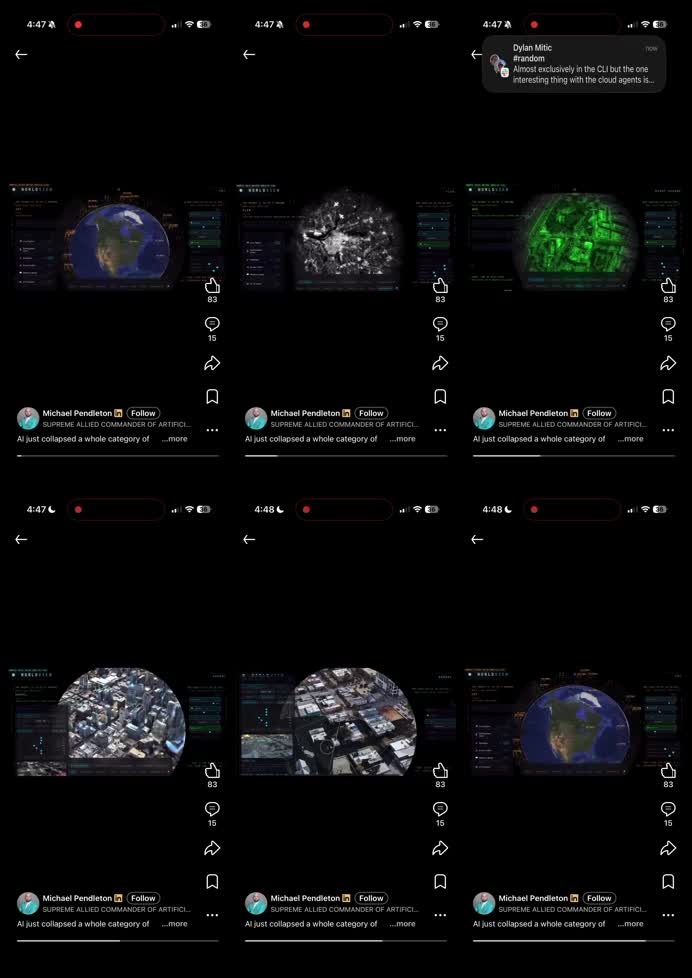
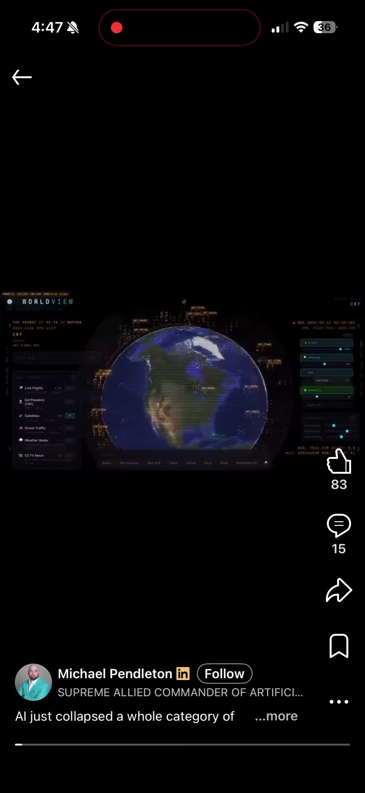
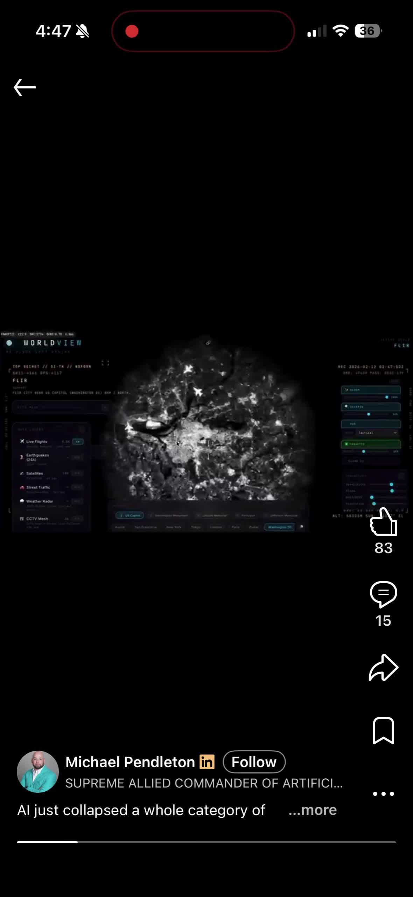
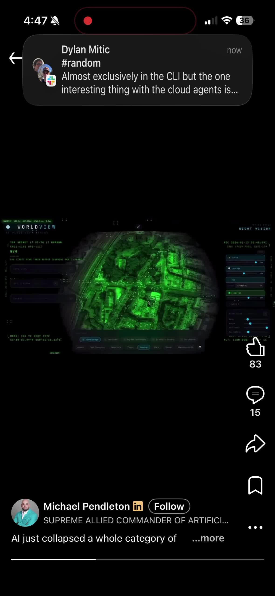
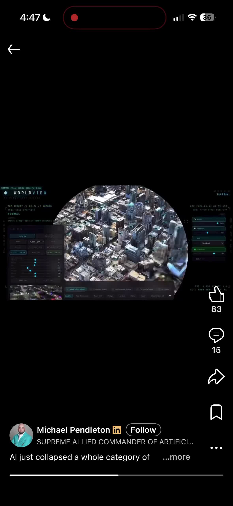
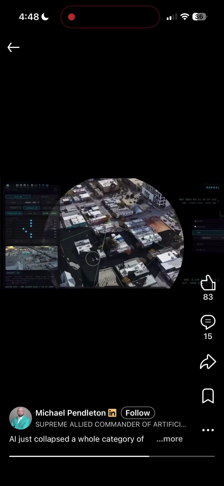
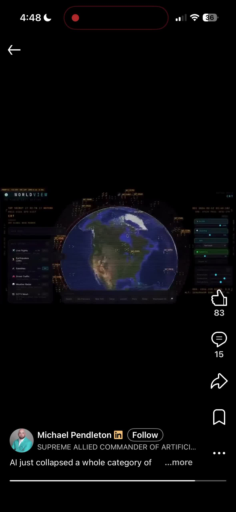

# Video UI/UX Frontend Analysis (Descriptive)

## 1. Recording Context

- **File:** `ScreenRecording_02-25-2026 16-47-22_1.MP4`
- **Duration:** ~68.7 seconds
- **Capture format:** Portrait mobile screen recording (1180x2556)
- **Visual mode:** Dark theme, short-form social feed interface

The recording presents one continuous viewing session of a single video post in a social-media style viewer. The visual language and control placement are consistent with modern vertical short-video interfaces.

## 2. Overall Screen Composition

The UI is organized into four persistent layers:

1. **Top utility/navigation layer**
- Back arrow at upper-left
- Device/system indicators across the top safe area
- Recording/focus indicators visible in the status region

2. **Primary media layer (center)**
- The post video appears centered within the screen
- The media occupies a smaller rectangular region relative to total viewport height
- Large black negative space surrounds the video area above and around the content

3. **Right interaction rail**
- Vertical stack of icon actions: like, comment, share, bookmark
- Counts are shown for like and comment
- Action rail remains anchored while media content changes

4. **Bottom metadata + progress layer**
- Creator row (avatar, name, affiliation badge, follow button)
- Caption text in truncated state with `...more`
- Horizontal playback/progress bar at the bottom edge

## 3. Visual Design Characteristics

### Color and contrast
- Predominantly black background with white/light text and iconography
- Bright, saturated media visuals (blue/green/gray geospatial imagery) contrast strongly against dark UI chrome
- Secondary metadata uses dimmer gray tones than primary labels

### Typography and text density
- Small-to-medium text scale for metadata and counts
- Caption area is compact and clipped to a short excerpt
- Creator identity row packs several elements in one line (name, badge, follow action)

### Iconography
- Interaction icons are standard social glyphs and visually familiar
- Icons are line-based, high contrast, and consistently spaced on the right rail

## 4. Media Presentation Behavior

The post content appears to be geospatial/planetary visualization footage with continuous motion:
- Earth/globe views
- Satellite-like grayscale and green-tinted overlays
- Urban map/building-level transitions

The media sequence advances while the surrounding UI remains structurally unchanged. The progress bar at the bottom advances throughout playback, indicating continuous clip progression.

## 5. Interaction Model (Observed)

The recording primarily shows passive viewing behavior. No clear tap transitions or navigation changes are visible in sampled frames.

Persistent interaction affordances present throughout playback:
- Like/comment/share/save actions
- Follow action near creator identity
- Caption expansion affordance (`...more`)
- Back navigation at top-left

The interface keeps controls available at all times rather than switching to a pure fullscreen-media state.

## 6. Information Architecture (On-Screen Prioritization)

The on-screen hierarchy appears as:
1. Media preview (center)
2. Social interaction rail (right)
3. Creator identity and caption context (bottom)
4. Navigation/system state (top)

The layout gives equal persistence to media and social controls. Content context (creator + caption) is always visible in the lower band.

## 7. Frontend Structure (Descriptive Inference)

From visual behavior, the frontend appears to use layered mobile UI composition:
- Fullscreen root container with dark background
- Media container centered in viewport
- Absolute-positioned right control rail
- Absolute-positioned bottom metadata/progress strip
- Safe-area-aware top controls/status region

This suggests a feed-view renderer with static overlay regions and a continuously updating media/progress state.

## 8. Motion and Temporal Rhythm

- Motion is concentrated inside the media region; UI chrome is largely static
- The visual pace of the media is relatively high (frequent scene/content transformations)
- Progress feedback is continuous and linear

## 9. UI/UX Characterization Summary

This video shows a dark-mode, vertical short-video viewing interface with persistent social actions and creator context overlays. The presentation emphasizes continuous media consumption with always-visible engagement controls. The frontend composition appears overlay-driven, with stable interaction scaffolding around a dynamic media core.
